 

### Currently

Full-stack engineer working mostly in TypeScript, React, and Next.js, with a
Rails backend on the other side of the wire. Recent work: rebuilding a
logistics company's web presence on Next.js, an LLM-driven content engine
(64 posts in four months, +197% search impressions), and hand-rolled SVG
charts for live freight-rate data.

Aspiring to be better, one commit at a time.

### Stack

`TypeScript` `React` `Next.js` `Node` `Tailwind` `Rails` `Python` `Rust` `Postgres`

### Elsewhere

The banner above regenerates daily from live GitHub data. No third-party
image services, no broken badges. If you can read a terminal, you know the
numbers are real.

 

The stats banner is built by a small Python script in this repo and refreshed by a GitHub Action.

